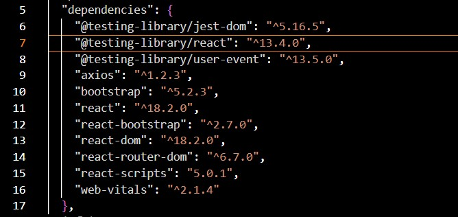
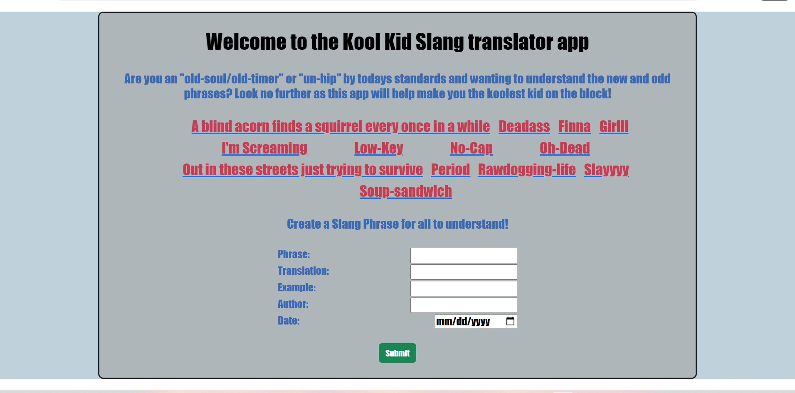
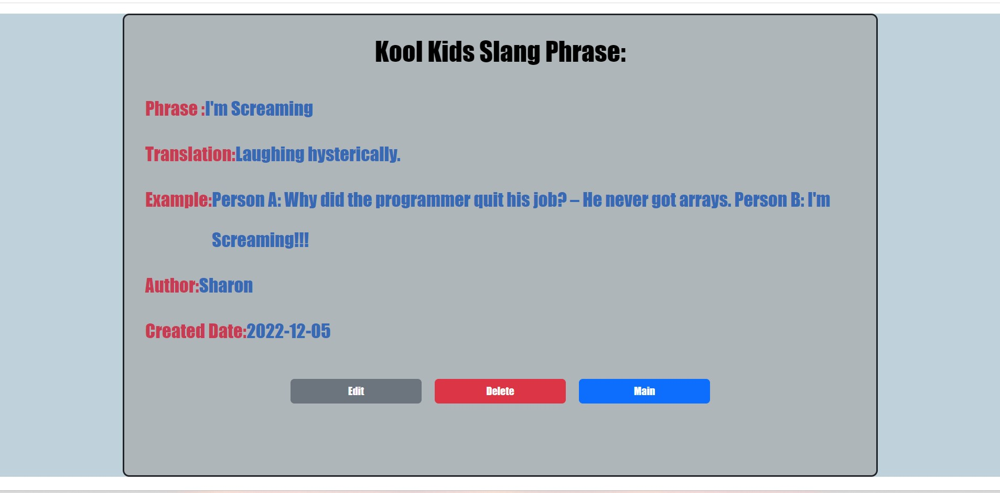
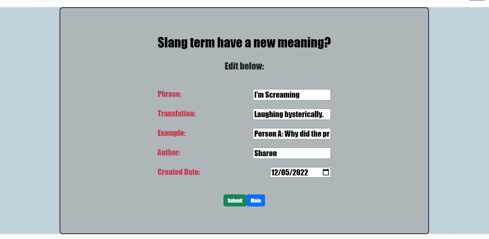

# KKST-App 
### By: Cody Jennings 

Full MERN Stack translator app with CRUD functionality. My idea was inspired by our diverse PerScholas cohort with many walks of life. This comes with many new unique phrases being introduced in everyday conversation. While I thought this was an original idea I remembered Urban dictionary already existed, this is essentially a made from scratch Urban dictionary clone. I do not use very many slang terms personally but thought this was a nice shout-out to my friends who use these phrases throughout the course.

### Live Link to Kool Kid Translator App
[Frontend Live-Site/Click here](https://kkst-frontend.onrender.com)
[Backend Live-Site/Click here](https://kkst-backend.onrender.com/KKST-App)

### Github Links 

[Front-End/React](https://github.com/Cody-Jennings/Project3-KKST-App-frontend.git)

[Back-End/MongoDB-Mongoose,Express,Node](https://github.com/Cody-Jennings/Project3-KKST-App-backend.git)

## Access

You can fork and or clone the repo by copy and pasting the following in your terminal. Do not forget to install the dependencies displayed below to correctly get the app to work, (trust me). 

Backend

`git clone https://github.com/Cody-Jennings/Project3-KKST-App-backend.git`

Frontend

`git clone https://github.com/Cody-Jennings/Project3-KKST-App-frontend.git`

## Kool Kid Slang Translator App / How To

When the user first clicks on the live link they are directed to the main page which gives a brief introduction/ overview of why the app exists. The main page also shows previously created slang phrases and a form to create a new phrase. Main page as shown below: 
 The user can click on any existing slang phrase and be directed to that phrase's about page. This about page lists the slang phrase, translation, an example, the author, and date created. At the bottom of the page the user has the option to edit or delete the phrase and to navigate back to the main page. Phrase about page as shown below:  

The user can delete the phrase and is redirected back to the main page were a new update list of phrases are at. If the user simply wanted to view the phrase and does not want to edit or delete the phrase they can click main and be directed back to the main page.
If the user decides to edit the phrase they can click edit and be directed to the edit page. This page auto-populates input fields with current data and allows users to edit any or all inputs. Once the user finishes editing their desired fields they can click Submit and be directed back to the phrase's about page. If the user decides not to make any changes they can click main and return to main page. Phrase edit page as shown below:  

## Technologies Used 

- HTML
- JavaScript
- CSS
- MERN Stack Fullstack
- MongoDb
- Mongoose
- Express
- React
- Node
- Axios
- Github
- BootStrap
- Render Web Hosting Services

## Unsolved Issues
An unsolved issue I did not get to resolve was on the phrase's about page. There is no space between input title and user input, user input is also staggered. I would like all of the user inputs to be spaced further to the right, similiar spacing and idention to the fields on the edit page.

## Future Enhancements

My goal is to add a login page that accepts user logins and accepts their data. Phrases can only be edited by their "author". I'm also interested in adding a user page that displays all the phrases they have created, a  phrase search bar and a phrase like or dislike button. 

## Resources

- [w3Schools]

- [Youtube]

- [Github]

- [React-bootstrap](https://react-bootstrap.github.io/getting-started/introduction/)

- [Stack Overflow]

- [MDN]

- [Technology component Documentation]

- [Urban Dictionary]

## Acknowledgements

- Tishana Trainor 
- Kasper Kain
- Arianna Bunn
- Hadia Shafique
- Sharon Ogbonna
- Long Hoang
- Vogue Boney
- All other classmates who took time to help with my project code and gave confidence boosters and feedback/criticism.

## Disclaimer

I am not affiliated with nor own any rights regarding this translator app's phrases, translations, examples or author names. No profits were generated from this project. All materials utilized were for educational and demonstration purposes only. 
